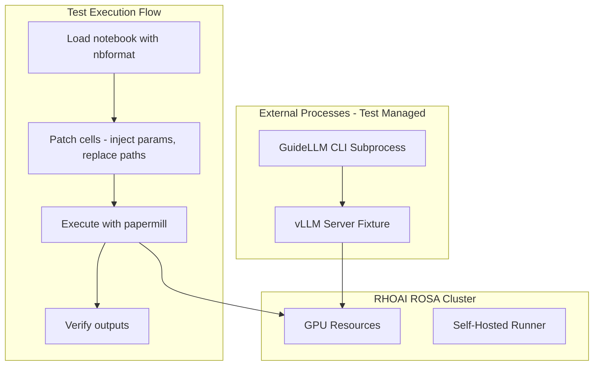
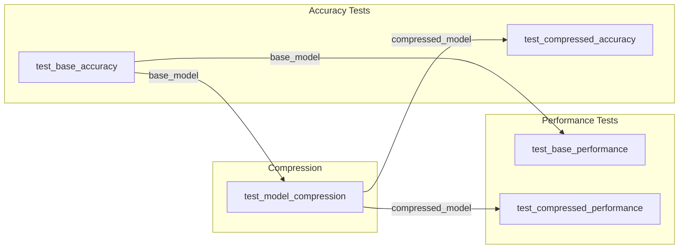

# E2E Tests for Model Serve Flow (Test-Time Injection)

## Overview

Create papermill-based e2e tests that **dynamically patch notebooks at test time** using `nbformat`. Original notebooks remain unchanged. vLLM and GuideLLM run as external processes managed by test fixtures. GitHub Actions workflow targets self-hosted GPU runners on RHOAI ROSA cluster.

## Key Design Decision

**Test-time injection** - Notebooks are patched in memory before execution:

---

## Fixes and Enhancements (Added)

The following issues have been addressed in this plan:

### 1. Artifact Path Mismatch Fix

The GitHub workflow now includes a step to copy downloaded artifacts to the location expected by pytest fixtures (`/tmp/pytest-of-runner/model_serve_e2e`). An environment variable `MODEL_ARTIFACTS_DIR` is also set for fixture discovery.

### 2. Module Init File

Added `tests/examples/model_serve_flow/__init__.py` to enable proper Python module imports.

### 3. Test Timeouts

All e2e tests now have explicit `@pytest.mark.timeout()` markers:

- Accuracy tests: 4 hours (14400s)
- Performance tests: 1 hour (3600s)
- Compression: 2 hours (7200s)

### 4. Artifact Cleanup

- Added `cleanup_artifacts` session fixture that removes test artifacts after completion (unless `KEEP_TEST_ARTIFACTS=1`)
- Added cleanup steps in GitHub workflow after artifact upload
- Prevents disk space accumulation from large model files

### 5. Dependencies

Added `pytest-timeout>=2.3.0` to test dependencies.

---

- Inject papermill parameter cells
- Replace hardcoded path assignments with parameterized values
- Skip/modify cells that conflict with automation
- Original notebook files are never modified

---

## Architecture



---

## Test Dependencies (pytest-dependency)

Tests use `pytest-dependency` to ensure correct execution order since notebooks produce artifacts consumed by later tests. If a dependency fails, dependent tests are **skipped** (not failed).



**Dependency Markers**:

- `@pytest.mark.dependency(name="base_accuracy")` - names this test
- `@pytest.mark.dependency(depends=["base_accuracy"])` - requires base_accuracy to pass first

---

## Notebook Dependencies Analysis

| Notebook | GPU Required | vLLM Required | GuideLLM Required | Input Dependencies |

|----------|--------------|---------------|-------------------|-------------------|

| 01_Base_Accuracy | Yes (LM-Eval) | No | No | HuggingFace model |

| 02_Base_Performance | Yes (vLLM) | Yes (server) | Yes (benchmark) | Base model from 01 |

| 03_Model_Compression | Yes (LLM Compressor) | No | No | Base model from 01 |

| 04_Compressed_Accuracy | Yes (LM-Eval) | No | No | Compressed model from 03 |

| 05_Compressed_Performance | Yes (vLLM) | Yes (server) | Yes (benchmark) | Compressed model from 03 |

---

## Files to Create

### 1. Notebook Patcher Utility

#### [`tests/examples/model_serve_flow/notebook_patcher.py`](tests/examples/model_serve_flow/notebook_patcher.py)

Core utility that patches notebooks before execution:

```python
"""Utility to patch notebooks at test time for automated execution."""
import copy
import json
import re
from pathlib import Path
from typing import Any

import nbformat
from nbformat import NotebookNode


class NotebookPatcher:
    """Patches notebooks for automated test execution without modifying source files."""
    
    def __init__(self, notebook_path: Path):
        self.notebook_path = notebook_path
        self.notebook = nbformat.read(str(notebook_path), as_version=4)
        self._original = copy.deepcopy(self.notebook)
    
    def inject_parameters_cell(self, parameters: dict[str, Any]) -> "NotebookPatcher":
        """Inject a parameters cell at the top of the notebook.
        
        Papermill looks for cells tagged with 'parameters' to know where
        to inject values. We create one dynamically.
        """
        param_lines = ["# Parameters (injected by test)"]
        for key, value in parameters.items():
            if isinstance(value, str):
                param_lines.append(f'{key} = "{value}"')
            elif isinstance(value, (list, dict)):
                param_lines.append(f"{key} = {json.dumps(value)}")
            else:
                param_lines.append(f"{key} = {value}")
        
        param_cell = nbformat.v4.new_code_cell("\n".join(param_lines))
        param_cell.metadata["tags"] = ["parameters"]
        
        # Insert after first markdown cell (usually title/description)
        insert_idx = 1
        for i, cell in enumerate(self.notebook.cells):
            if cell.cell_type == "code":
                insert_idx = i
                break
        
        self.notebook.cells.insert(insert_idx, param_cell)
        return self
    
    def replace_hardcoded_paths(self, replacements: dict[str, str]) -> "NotebookPatcher":
        """Replace hardcoded path assignments with parameterized values.
        
        Args:
            replacements: Dict mapping variable names to parameter references
                e.g., {"base_model_path": "base_model_path",  # use injected param
                       "base_results_dir": "base_results_dir"}
        """
        for cell in self.notebook.cells:
            if cell.cell_type != "code":
                continue
            
            source = cell.source
            modified = False
            
            for var_name, param_name in replacements.items():
                # Match patterns like: var_name = "..." or var_name = f"..."
                patterns = [
                    rf'^({var_name}\s*=\s*)f?"[^"]*"',  # var = "value" or f"value"
                    rf'^({var_name}\s*=\s*)f?\'[^\']*\'',  # var = 'value'
                    rf'^({var_name}\s*=\s*)[^#\n]+',  # var = expression
                ]
                
                for pattern in patterns:
                    if re.search(pattern, source, re.MULTILINE):
                        # Comment out original and add parameterized version
                        source = re.sub(
                            pattern,
                            f"# Original: \\g<0>\n{var_name} = {param_name}  # Injected by test",
                            source,
                            count=1,
                            flags=re.MULTILINE
                        )
                        modified = True
                        break
            
            if modified:
                cell.source = source
        
        return self
    
    def skip_cells_matching(self, patterns: list[str]) -> "NotebookPatcher":
        """Skip cells containing specific patterns (e.g., pip install, manual instructions).
        
        Wraps matching cells in 'if False:' to skip execution.
        """
        for cell in self.notebook.cells:
            if cell.cell_type != "code":
                continue
            
            for pattern in patterns:
                if re.search(pattern, cell.source):
                    cell.source = f"# Skipped by test automation\nif False:\n    " + \
                                  cell.source.replace("\n", "\n    ")
                    break
        
        return self
    
    def comment_out_cells_with_pattern(self, pattern: str) -> "NotebookPatcher":
        """Comment out entire cells matching a pattern."""
        for cell in self.notebook.cells:
            if cell.cell_type == "code" and re.search(pattern, cell.source):
                cell.source = "# Commented out by test automation\n# " + \
                              cell.source.replace("\n", "\n# ")
        return self
    
    def get_patched_notebook(self) -> NotebookNode:
        """Return the patched notebook."""
        return self.notebook
    
    def save_to(self, output_path: Path) -> Path:
        """Save patched notebook to a new location."""
        output_path.parent.mkdir(parents=True, exist_ok=True)
        nbformat.write(self.notebook, str(output_path))
        return output_path
    
    def reset(self) -> "NotebookPatcher":
        """Reset to original notebook state."""
        self.notebook = copy.deepcopy(self._original)
        return self


# Notebook-specific patching configurations
NOTEBOOK_PATCHES = {
    "Base_Accuracy_Benchmarking.ipynb": {
        "parameters": {
            "model_name": "RedHatAI/Llama-3.1-8B-Instruct",
            "tasks": ["arc_easy"],  # Reduced for testing
        },
        "path_replacements": {
            "model_name": "model_name",
            "base_model_path": "base_model_path", 
            "base_results_dir": "base_results_dir",
        },
        "skip_patterns": [r"!pip install"],
    },
    "Base_Performance_Benchmarking.ipynb": {
        "parameters": {
            "vllm_target": "http://127.0.0.1:8000",
        },
        "path_replacements": {
            "base_model_path": "base_model_path",
        },
        "skip_patterns": [r"!pip install", r"vllm serve", r"guidellm benchmark"],
    },
    "Model_Compression.ipynb": {
        "parameters": {
            "num_calibration_samples": 64,  # Reduced for testing
            "max_sequence_length": 512,
        },
        "path_replacements": {
            "base_model_path": "base_model_path",
            "compressed_model_path": "compressed_model_path",
        },
        "skip_patterns": [r"!pip install"],
    },
    "Compressed_Accuracy_Benchmarking.ipynb": {
        "parameters": {
            "tasks": ["arc_easy"],
        },
        "path_replacements": {
            "compressed_model_path": "compressed_model_path",
            "compressed_results_dir": "compressed_results_dir",
        },
        "skip_patterns": [r"!pip install"],
    },
    "Compressed_Performance_Benchmarking.ipynb": {
        "parameters": {
            "vllm_target": "http://127.0.0.1:8001",
        },
        "path_replacements": {
            "compressed_model_path": "compressed_model_path",
        },
        "skip_patterns": [r"!pip install", r"vllm serve", r"guidellm benchmark"],
    },
}
```

---

### 2. Test Fixtures

#### [`tests/examples/model_serve_flow/conftest.py`](tests/examples/model_serve_flow/conftest.py)

```python
"""Pytest fixtures for model-serve-flow e2e tests.

Note: The `repo_root` fixture is inherited from tests/conftest.py
"""
import os
import shutil
import subprocess
import time
from pathlib import Path
from typing import Generator

import pytest
import requests

from .notebook_patcher import NotebookPatcher, NOTEBOOK_PATCHES


def pytest_configure(config):
    """Register custom markers."""
    config.addinivalue_line("markers", "e2e: end-to-end test")
    config.addinivalue_line("markers", "gpu: requires GPU resources")
    config.addinivalue_line("markers", "requires_vllm: requires vLLM server")
    config.addinivalue_line("markers", "requires_guidellm: requires GuideLLM")
    config.addinivalue_line("markers", "dependency: test dependency marker")
    config.addinivalue_line("markers", "timeout: test timeout in seconds")


# Default timeout for e2e tests (4 hours for accuracy, 1 hour for performance)
DEFAULT_ACCURACY_TIMEOUT = 4 * 60 * 60  # 4 hours in seconds
DEFAULT_PERFORMANCE_TIMEOUT = 60 * 60  # 1 hour in seconds


@pytest.fixture(scope="session")
def model_serve_flow_path(repo_root) -> Path:
    """Path to model-serve-flow example."""
    return repo_root / "examples" / "model-serve-flow"


@pytest.fixture(scope="session")
def test_output_dir(tmp_path_factory) -> Path:
    """Session-scoped directory for all test outputs."""
    return tmp_path_factory.mktemp("model_serve_e2e")


@pytest.fixture(scope="session")
def base_model_dir(test_output_dir) -> Path:
    """Directory for base model artifacts."""
    path = test_output_dir / "base_model"
    path.mkdir(exist_ok=True)
    return path


@pytest.fixture(scope="session")
def compressed_model_dir(test_output_dir) -> Path:
    """Directory for compressed model artifacts."""
    path = test_output_dir / "compressed_model"
    path.mkdir(exist_ok=True)
    return path


@pytest.fixture(scope="session")
def results_dir(test_output_dir) -> Path:
    """Directory for benchmark results."""
    path = test_output_dir / "results"
    path.mkdir(exist_ok=True)
    return path


@pytest.fixture(scope="session")
def executed_notebooks_dir(test_output_dir) -> Path:
    """Directory for executed notebook outputs."""
    path = test_output_dir / "executed_notebooks"
    path.mkdir(exist_ok=True)
    return path


@pytest.fixture
def notebook_patcher():
    """Factory fixture for creating NotebookPatcher instances."""
    def _create_patcher(notebook_path: Path) -> NotebookPatcher:
        return NotebookPatcher(notebook_path)
    return _create_patcher


class VLLMServer:
    """Context manager for vLLM server lifecycle."""
    
    def __init__(
        self,
        model_path: Path,
        host: str = "127.0.0.1",
        port: int = 8000,
        gpu_memory_utilization: float = 0.6,
        max_model_len: int = 2048,
    ):
        self.model_path = model_path
        self.host = host
        self.port = port
        self.gpu_memory_utilization = gpu_memory_utilization
        self.max_model_len = max_model_len
        self.process = None
        self.url = f"http://{host}:{port}"
    
    def start(self, timeout: int = 300) -> str:
        """Start vLLM server and wait for it to be ready."""
        cmd = [
            "vllm", "serve", str(self.model_path),
            "--host", self.host,
            "--port", str(self.port),
            "--gpu-memory-utilization", str(self.gpu_memory_utilization),
            "--tensor-parallel-size", "1",
            "--max-model-len", str(self.max_model_len),
        ]
        
        print(f"Starting vLLM server: {' '.join(cmd)}")
        self.process = subprocess.Popen(
            cmd,
            stdout=subprocess.PIPE,
            stderr=subprocess.STDOUT,
        )
        
        self._wait_for_ready(timeout)
        print(f"vLLM server ready at {self.url}")
        return self.url
    
    def _wait_for_ready(self, timeout: int):
        """Wait for server health endpoint."""
        start = time.time()
        while time.time() - start < timeout:
            try:
                resp = requests.get(f"{self.url}/health", timeout=5)
                if resp.status_code == 200:
                    return
            except requests.exceptions.ConnectionError:
                pass
            time.sleep(5)
        raise TimeoutError(f"vLLM server not ready after {timeout}s")
    
    def stop(self):
        """Stop the vLLM server."""
        if self.process:
            print("Stopping vLLM server...")
            self.process.terminate()
            try:
                self.process.wait(timeout=30)
            except subprocess.TimeoutExpired:
                self.process.kill()
            self.process = None


@pytest.fixture
def vllm_server_factory():
    """Factory fixture for creating vLLM server instances."""
    servers = []
    
    def _create_server(**kwargs) -> VLLMServer:
        server = VLLMServer(**kwargs)
        servers.append(server)
        return server
    
    yield _create_server
    
    # Cleanup all servers
    for server in servers:
        server.stop()


def run_guidellm_benchmark(
    target_url: str,
    output_path: Path,
    max_seconds: int = 120,
    prompt_tokens: int = 1024,
    output_tokens: int = 512,
) -> Path:
    """Run GuideLLM benchmark and return results path."""
    cmd = [
        "guidellm", "benchmark",
        "--target", target_url,
        "--profile", "sweep",
        "--max-seconds", str(max_seconds),
        "--data", f"prompt_tokens={prompt_tokens},output_tokens={output_tokens}",
        "--output-path", str(output_path),
    ]
    
    print(f"Running GuideLLM: {' '.join(cmd)}")
    result = subprocess.run(cmd, capture_output=True, text=True)
    
    if result.returncode != 0:
        print(f"GuideLLM stdout: {result.stdout}")
        print(f"GuideLLM stderr: {result.stderr}")
        raise RuntimeError(f"GuideLLM failed with code {result.returncode}")
    
    return output_path


@pytest.fixture
def guidellm_runner():
    """Fixture providing GuideLLM benchmark runner."""
    return run_guidellm_benchmark


@pytest.fixture(scope="session", autouse=True)
def cleanup_artifacts(test_output_dir):
    """Clean up test artifacts after test session completes.
    
    Artifacts are preserved if KEEP_TEST_ARTIFACTS=1 is set (useful for debugging).
    """
    yield
    
    if os.environ.get("KEEP_TEST_ARTIFACTS", "0") == "1":
        print(f"Keeping test artifacts at: {test_output_dir}")
        return
    
    # Clean up large model artifacts to prevent disk space issues
    print(f"Cleaning up test artifacts at: {test_output_dir}")
    try:
        shutil.rmtree(test_output_dir, ignore_errors=True)
    except Exception as e:
        print(f"Warning: Failed to clean up artifacts: {e}")


@pytest.fixture
def artifact_dir_from_env(test_output_dir) -> Path:
    """Get artifact directory from environment or use default.
    
    This fixture allows performance tests to find artifacts downloaded
    from previous job's GitHub artifacts.
    """
    env_path = os.environ.get("MODEL_ARTIFACTS_DIR")
    if env_path and Path(env_path).exists():
        return Path(env_path)
    return test_output_dir
```

---

### 3. E2E Test Module

#### [`tests/examples/model_serve_flow/test_e2e_notebooks.py`](tests/examples/model_serve_flow/test_e2e_notebooks.py)

```python
"""End-to-end tests for model-serve-flow notebooks using test-time patching.

Tests use pytest-dependency to ensure correct execution order since notebooks
produce artifacts consumed by later tests.

Dependency graph:
    test_base_accuracy_full
        ├── test_base_performance_benchmark (needs base_model)
        └── test_model_compression (needs base_model)
                ├── test_compressed_accuracy (needs compressed_model)
                └── test_compressed_performance_benchmark (needs compressed_model)
"""
import json
import os
from pathlib import Path

import papermill as pm
import pytest

from .notebook_patcher import NotebookPatcher, NOTEBOOK_PATCHES


class TestBaseAccuracyBenchmarking:
    """E2E tests for 01_Base_Accuracy_Benchmarking notebook."""
    
    NOTEBOOK_DIR = "01_Base_Accuracy_Benchmarking"
    NOTEBOOK_NAME = "Base_Accuracy_Benchmarking.ipynb"
    
    @pytest.mark.e2e
    @pytest.mark.gpu
    @pytest.mark.timeout(14400)  # 4 hours
    @pytest.mark.dependency(name="base_accuracy")
    def test_base_accuracy_full(
        self,
        model_serve_flow_path,
        base_model_dir,
        results_dir,
        executed_notebooks_dir,
        notebook_patcher,
    ):
        """Run base accuracy benchmarking with patched notebook."""
        notebook_path = model_serve_flow_path / self.NOTEBOOK_DIR / self.NOTEBOOK_NAME
        
        # Get model name from env or use default
        model_name = os.environ.get("TEST_MODEL_NAME", "RedHatAI/Llama-3.1-8B-Instruct")
        model_subdir = model_name.replace("/", "-")
        
        # Define test parameters
        test_params = {
            "model_name": model_name,
            "base_model_path": str(base_model_dir / model_subdir),
            "base_results_dir": str(results_dir / "base_accuracy"),
            "tasks": json.dumps(["arc_easy"]),  # Reduced for testing
        }
        
        # Patch notebook
        patcher = notebook_patcher(notebook_path)
        patcher.inject_parameters_cell(test_params)
        patcher.replace_hardcoded_paths({
            "model_name": "model_name",
            "base_model_path": "base_model_path",
            "base_results_dir": "base_results_dir",
            "tasks": "tasks",
        })
        patcher.skip_cells_matching([r"!pip install"])
        
        # Save patched notebook
        patched_path = executed_notebooks_dir / f"patched_{self.NOTEBOOK_NAME}"
        patcher.save_to(patched_path)
        
        # Execute
        output_path = executed_notebooks_dir / f"executed_{self.NOTEBOOK_NAME}"
        pm.execute_notebook(
            str(patched_path),
            str(output_path),
            cwd=str(notebook_path.parent),
            kernel_name="python3",
        )
        
        # Verify outputs
        assert Path(test_params["base_model_path"]).exists(), "Base model not saved"
        assert (Path(test_params["base_results_dir"]) / "results.pkl").exists(), \
            "Results not saved"


class TestBasePerformanceBenchmarking:
    """E2E tests for 02_Base_Performance_Benchmarking notebook.
    
    This test:
    1. Starts vLLM server externally
    2. Runs GuideLLM benchmark externally
    3. Runs notebook to verify results loading (with skipped CLI cells)
    
    Depends on: test_base_accuracy_full (provides base_model)
    """
    
    NOTEBOOK_DIR = "02_Base_Performance_Benchmarking"
    NOTEBOOK_NAME = "Base_Performance_Benchmarking.ipynb"
    
    @pytest.mark.e2e
    @pytest.mark.gpu
    @pytest.mark.timeout(3600)  # 1 hour
    @pytest.mark.requires_vllm
    @pytest.mark.requires_guidellm
    @pytest.mark.dependency(name="base_performance", depends=["base_accuracy"])
    def test_base_performance_benchmark(
        self,
        model_serve_flow_path,
        base_model_dir,
        results_dir,
        executed_notebooks_dir,
        notebook_patcher,
        vllm_server_factory,
        guidellm_runner,
    ):
        """Run base performance benchmarking with external vLLM/GuideLLM."""
        notebook_path = model_serve_flow_path / self.NOTEBOOK_DIR / self.NOTEBOOK_NAME
        
        # Find base model (should exist from previous test)
        model_name = os.environ.get("TEST_MODEL_NAME", "RedHatAI/Llama-3.1-8B-Instruct")
        model_subdir = model_name.replace("/", "-")
        model_path = base_model_dir / model_subdir
        
        assert model_path.exists(), f"Base model not found at {model_path}"
        
        # Start vLLM server
        server = vllm_server_factory(
            model_path=model_path,
            port=8000,
            gpu_memory_utilization=0.6,
        )
        server_url = server.start()
        
        # Run GuideLLM benchmark
        benchmark_output = results_dir / "base_performance_benchmarks.json"
        guidellm_runner(
            target_url=server_url,
            output_path=benchmark_output,
            max_seconds=60,  # Reduced for testing
        )
        
        # Patch and run notebook for results loading/verification
        test_params = {
            "base_model_path": str(model_path),
            "vllm_target": server_url,
        }
        
        patcher = notebook_patcher(notebook_path)
        patcher.inject_parameters_cell(test_params)
        patcher.replace_hardcoded_paths({
            "base_model_path": "base_model_path",
        })
        # Skip vLLM serve and GuideLLM benchmark cells (we ran them externally)
        patcher.skip_cells_matching([
            r"!pip install",
            r"vllm serve",
            r"guidellm benchmark",
        ])
        
        patched_path = executed_notebooks_dir / f"patched_{self.NOTEBOOK_NAME}"
        patcher.save_to(patched_path)
        
        output_path = executed_notebooks_dir / f"executed_{self.NOTEBOOK_NAME}"
        pm.execute_notebook(
            str(patched_path),
            str(output_path),
            cwd=str(notebook_path.parent),
            kernel_name="python3",
        )
        
        # Verify benchmark results exist
        assert benchmark_output.exists(), "Benchmark results not created"
        
        # Stop server
        server.stop()


class TestModelCompression:
    """E2E tests for 03_Model_Compression notebook.
    
    Depends on: test_base_accuracy_full (provides base_model)
    """
    
    NOTEBOOK_DIR = "03_Model_Compression"
    NOTEBOOK_NAME = "Model_Compression.ipynb"
    
    @pytest.mark.e2e
    @pytest.mark.gpu
    @pytest.mark.timeout(7200)  # 2 hours
    @pytest.mark.dependency(name="compression", depends=["base_accuracy"])
    def test_model_compression(
        self,
        model_serve_flow_path,
        base_model_dir,
        compressed_model_dir,
        executed_notebooks_dir,
        notebook_patcher,
    ):
        """Run model compression with patched notebook."""
        notebook_path = model_serve_flow_path / self.NOTEBOOK_DIR / self.NOTEBOOK_NAME
        
        model_name = os.environ.get("TEST_MODEL_NAME", "RedHatAI/Llama-3.1-8B-Instruct")
        model_subdir = model_name.replace("/", "-")
        base_path = base_model_dir / model_subdir
        compressed_path = compressed_model_dir / f"{model_subdir}-int8-dynamic"
        
        assert base_path.exists(), f"Base model not found at {base_path}"
        
        test_params = {
            "base_model_path": str(base_path),
            "compressed_model_path": str(compressed_path),
            "num_calibration_samples": 64,  # Reduced for testing
            "max_sequence_length": 512,  # Reduced for testing
        }
        
        patcher = notebook_patcher(notebook_path)
        patcher.inject_parameters_cell(test_params)
        patcher.replace_hardcoded_paths({
            "base_model_path": "base_model_path",
            "compressed_model_path": "compressed_model_path",
        })
        patcher.skip_cells_matching([r"!pip install"])
        
        patched_path = executed_notebooks_dir / f"patched_{self.NOTEBOOK_NAME}"
        patcher.save_to(patched_path)
        
        output_path = executed_notebooks_dir / f"executed_{self.NOTEBOOK_NAME}"
        pm.execute_notebook(
            str(patched_path),
            str(output_path),
            cwd=str(notebook_path.parent),
            kernel_name="python3",
        )
        
        # Verify compressed model
        assert compressed_path.exists(), "Compressed model not created"
        assert (compressed_path / "config.json").exists(), "Model config not found"


class TestCompressedAccuracyBenchmarking:
    """E2E tests for 04_Compressed_Accuracy_Benchmarking notebook.
    
    Depends on: test_model_compression (provides compressed_model)
    """
    
    NOTEBOOK_DIR = "04_Compressed_Accuracy_Benchmarking"
    NOTEBOOK_NAME = "Compressed_Accuracy_Benchmarking.ipynb"
    
    @pytest.mark.e2e
    @pytest.mark.gpu
    @pytest.mark.timeout(14400)  # 4 hours
    @pytest.mark.dependency(name="compressed_accuracy", depends=["compression"])
    def test_compressed_accuracy(
        self,
        model_serve_flow_path,
        compressed_model_dir,
        results_dir,
        executed_notebooks_dir,
        notebook_patcher,
    ):
        """Run compressed accuracy benchmarking."""
        notebook_path = model_serve_flow_path / self.NOTEBOOK_DIR / self.NOTEBOOK_NAME
        
        model_name = os.environ.get("TEST_MODEL_NAME", "RedHatAI/Llama-3.1-8B-Instruct")
        model_subdir = f"{model_name.replace('/', '-')}-int8-dynamic"
        compressed_path = compressed_model_dir / model_subdir
        
        assert compressed_path.exists(), f"Compressed model not found at {compressed_path}"
        
        test_params = {
            "compressed_model_path": str(compressed_path),
            "compressed_results_dir": str(results_dir / "compressed_accuracy"),
            "tasks": json.dumps(["arc_easy"]),
        }
        
        patcher = notebook_patcher(notebook_path)
        patcher.inject_parameters_cell(test_params)
        patcher.replace_hardcoded_paths({
            "compressed_model_path": "compressed_model_path",
            "compressed_results_dir": "compressed_results_dir",
            "tasks": "tasks",
        })
        patcher.skip_cells_matching([r"!pip install"])
        
        patched_path = executed_notebooks_dir / f"patched_{self.NOTEBOOK_NAME}"
        patcher.save_to(patched_path)
        
        output_path = executed_notebooks_dir / f"executed_{self.NOTEBOOK_NAME}"
        pm.execute_notebook(
            str(patched_path),
            str(output_path),
            cwd=str(notebook_path.parent),
            kernel_name="python3",
        )
        
        assert (Path(test_params["compressed_results_dir"]) / "results.pkl").exists()


class TestCompressedPerformanceBenchmarking:
    """E2E tests for 05_Compressed_Performance_Benchmarking notebook.
    
    Depends on: test_model_compression (provides compressed_model)
    """
    
    NOTEBOOK_DIR = "05_Compressed_Performance_Benchmarking"
    NOTEBOOK_NAME = "Compressed_Performance_Benchmarking.ipynb"
    
    @pytest.mark.e2e
    @pytest.mark.gpu
    @pytest.mark.timeout(3600)  # 1 hour
    @pytest.mark.requires_vllm
    @pytest.mark.requires_guidellm
    @pytest.mark.dependency(name="compressed_performance", depends=["compression"])
    def test_compressed_performance_benchmark(
        self,
        model_serve_flow_path,
        compressed_model_dir,
        results_dir,
        executed_notebooks_dir,
        notebook_patcher,
        vllm_server_factory,
        guidellm_runner,
    ):
        """Run compressed performance benchmarking."""
        notebook_path = model_serve_flow_path / self.NOTEBOOK_DIR / self.NOTEBOOK_NAME
        
        model_name = os.environ.get("TEST_MODEL_NAME", "RedHatAI/Llama-3.1-8B-Instruct")
        model_subdir = f"{model_name.replace('/', '-')}-int8-dynamic"
        compressed_path = compressed_model_dir / model_subdir
        
        assert compressed_path.exists(), f"Compressed model not found"
        
        # Start vLLM server on different port
        server = vllm_server_factory(
            model_path=compressed_path,
            port=8001,
            gpu_memory_utilization=0.6,
        )
        server_url = server.start()
        
        # Run GuideLLM
        benchmark_output = results_dir / "compressed_performance_benchmarks.json"
        guidellm_runner(
            target_url=server_url,
            output_path=benchmark_output,
            max_seconds=60,
        )
        
        # Run notebook for verification
        test_params = {
            "compressed_model_path": str(compressed_path),
            "vllm_target": server_url,
        }
        
        patcher = notebook_patcher(notebook_path)
        patcher.inject_parameters_cell(test_params)
        patcher.replace_hardcoded_paths({
            "compressed_model_path": "compressed_model_path",
        })
        patcher.skip_cells_matching([
            r"!pip install",
            r"vllm serve",
            r"guidellm benchmark",
        ])
        
        patched_path = executed_notebooks_dir / f"patched_{self.NOTEBOOK_NAME}"
        patcher.save_to(patched_path)
        
        output_path = executed_notebooks_dir / f"executed_{self.NOTEBOOK_NAME}"
        pm.execute_notebook(
            str(patched_path),
            str(output_path),
            cwd=str(notebook_path.parent),
            kernel_name="python3",
        )
        
        assert benchmark_output.exists()
        server.stop()
```

---

### 4. GitHub Actions Workflow

#### [`.github/workflows/model-serve-e2e-tests.yml`](.github/workflows/model-serve-e2e-tests.yml)

```yaml
name: Model Serve E2E Tests

on:
  workflow_dispatch:
    inputs:
      model_name:
        description: 'HuggingFace model to test'
        required: false
        default: 'RedHatAI/Llama-3.1-8B-Instruct'
      run_performance_tests:
        description: 'Run performance benchmarking tests'
        type: boolean
        default: true
  schedule:
    - cron: '0 0 * * 0'  # Weekly on Sunday

env:
  TEST_MODEL_NAME: ${{ github.event.inputs.model_name || 'RedHatAI/Llama-3.1-8B-Instruct' }}
  PYTORCH_CUDA_ALLOC_CONF: expandable_segments:True

jobs:
  accuracy-tests:
    name: Accuracy Benchmarking Tests
    runs-on: [self-hosted, rhoai, gpu, L40S]
    timeout-minutes: 360
    
    steps:
      - uses: actions/checkout@v4
      
      - name: Set up Python
        uses: actions/setup-python@v5
        with:
          python-version: '3.12'
          cache: 'pip'
      
      - name: Install dependencies
        run: |
          pip install -e ".[test]"
          pip install papermill nbformat ipykernel
          pip install torch transformers lm-eval accelerate llmcompressor datasets
      
      - name: Verify GPU
        run: |
          python -c "import torch; print(f'CUDA: {torch.cuda.is_available()}, GPU: {torch.cuda.get_device_name(0)}')"
          nvidia-smi
      
      - name: Run accuracy tests
        run: |
          pytest tests/examples/model_serve_flow/test_e2e_notebooks.py \
            -k "TestBaseAccuracyBenchmarking or TestModelCompression or TestCompressedAccuracyBenchmarking" \
            -v --tb=long \
            --junit-xml=results/accuracy-results.xml
      
      - name: Upload artifacts
        if: always()
        uses: actions/upload-artifact@v4
        with:
          name: accuracy-test-artifacts
          path: |
            results/
            /tmp/pytest-*/model_serve_e2e/
          retention-days: 30
      
      - name: Cleanup local model artifacts
        if: always()
        run: |
          # Clean up large model files after upload to free disk space
          # Artifacts are preserved in GitHub Actions artifacts
          echo "Cleaning up local model artifacts..."
          rm -rf /tmp/pytest-*/model_serve_e2e/ || true
          echo "Cleanup complete"

  performance-tests:
    name: Performance Benchmarking Tests
    runs-on: [self-hosted, rhoai, gpu, L40S]
    needs: accuracy-tests
    if: ${{ github.event.inputs.run_performance_tests != 'false' }}
    timeout-minutes: 180
    
    steps:
      - uses: actions/checkout@v4
      
      - name: Set up Python
        uses: actions/setup-python@v5
        with:
          python-version: '3.12'
          cache: 'pip'
      
      - name: Download model artifacts
        uses: actions/download-artifact@v4
        with:
          name: accuracy-test-artifacts
          path: artifacts/
      
      - name: Copy artifacts to expected test location
        run: |
          # Create the directory structure expected by pytest fixtures
          mkdir -p /tmp/pytest-of-runner/model_serve_e2e
          
          # Copy model artifacts to the expected location
          if [ -d "artifacts/model_serve_e2e" ]; then
            cp -r artifacts/model_serve_e2e/* /tmp/pytest-of-runner/model_serve_e2e/
          else
            # Fallback: copy all artifacts
            cp -r artifacts/* /tmp/pytest-of-runner/model_serve_e2e/
          fi
          
          # List copied artifacts for debugging
          echo "=== Copied artifacts ==="
          find /tmp/pytest-of-runner/model_serve_e2e -type f | head -20
          
          # Export path for pytest fixtures
          echo "MODEL_ARTIFACTS_DIR=/tmp/pytest-of-runner/model_serve_e2e" >> $GITHUB_ENV
      
      - name: Install dependencies
        run: |
          pip install -e ".[test]"
          pip install papermill nbformat ipykernel
          pip install vllm guidellm openai requests
      
      - name: Verify GPU and vLLM
        run: |
          nvidia-smi
          python -c "import vllm; print(f'vLLM: {vllm.__version__}')"
          guidellm --version || echo "GuideLLM ready"
      
      - name: Run performance tests
        run: |
          pytest tests/examples/model_serve_flow/test_e2e_notebooks.py \
            -k "TestBasePerformanceBenchmarking or TestCompressedPerformanceBenchmarking" \
            -v --tb=long \
            --junit-xml=results/performance-results.xml
      
      - name: Upload results
        if: always()
        uses: actions/upload-artifact@v4
        with:
          name: performance-test-results
          path: results/
          retention-days: 30
      
      - name: Cleanup model artifacts
        if: always()
        run: |
          # Clean up large model files to free disk space
          echo "Cleaning up model artifacts..."
          rm -rf /tmp/pytest-of-runner/model_serve_e2e || true
          rm -rf artifacts/ || true
          echo "Cleanup complete"
```

---

### 5. Test Module Init Files

#### [`tests/examples/model_serve_flow/__init__.py`](tests/examples/model_serve_flow/__init__.py)

```python
"""E2E tests for model-serve-flow notebooks."""
```

---

### 6. KFP Components (Using Test-Time Patching)

KFP components use the same `NotebookPatcher` utility to patch notebooks at runtime. Each component patches the notebook, executes it, and produces artifacts.

#### [`tests/examples/model_serve_flow/kfp_components/__init__.py`](tests/examples/model_serve_flow/kfp_components/__init__.py)

```python
"""KFP components for model-serve-flow notebooks."""
from .base_accuracy_component import base_accuracy_benchmarking_component
from .base_performance_component import base_performance_benchmarking_component
from .model_compression_component import model_compression_component
from .compressed_accuracy_component import compressed_accuracy_benchmarking_component
from .compressed_performance_component import compressed_performance_benchmarking_component

__all__ = [
    "base_accuracy_benchmarking_component",
    "base_performance_benchmarking_component",
    "model_compression_component",
    "compressed_accuracy_benchmarking_component",
    "compressed_performance_benchmarking_component",
]
```

**Note on NotebookPatcher location**: The `NotebookPatcher` class lives in `tests/examples/model_serve_flow/notebook_patcher.py`

(defined in Section 1 above). KFP components import it via sys.path manipulation when running in containers:

```python
# In KFP components (when running in container)
sys.path.insert(0, "/opt/app-root/src/tests/examples/model_serve_flow")
from notebook_patcher import NotebookPatcher
```

For local test imports:

```python
# In tests/examples/model_serve_flow/test_e2e_notebooks.py
from .notebook_patcher import NotebookPatcher, NOTEBOOK_PATCHES
```

#### [`tests/examples/model_serve_flow/kfp_components/base_accuracy_component.py`](tests/examples/model_serve_flow/kfp_components/base_accuracy_component.py)

```python
"""KFP component for base model accuracy benchmarking."""
from kfp import dsl
from kfp.dsl import Dataset, Output

# Base image with GPU support for RHOAI
BASE_IMAGE = "image-registry.openshift-image-registry.svc:5000/redhat-ods-applications/pytorch:2024.2-py312-cuda"


@dsl.component(
    base_image=BASE_IMAGE,
    packages_to_install=[
        "papermill",
        "nbformat",
        "ipykernel",
        "torch",
        "transformers",
        "lm-eval",
        "accelerate",
    ],
)
def base_accuracy_benchmarking_component(
    model_name: str,
    tasks: str,  # JSON array string e.g. '["mmlu", "arc_easy"]'
    base_model_output: Output[Dataset],
    accuracy_results_output: Output[Dataset],
    limit: int = None,
    batch_size: str = "auto",
):
    """Execute base accuracy benchmarking notebook via papermill with test-time patching.
    
    Args:
        model_name: HuggingFace model name (e.g., 'RedHatAI/Llama-3.1-8B-Instruct')
        tasks: JSON array of evaluation tasks
        base_model_output: Output artifact for saved base model
        accuracy_results_output: Output artifact for accuracy results
        limit: Limit number of samples per task (None for full eval)
        batch_size: Batch size for evaluation
    """
    import json
    import sys
    import papermill as pm
    from pathlib import Path
    
    # Add kfp_components to path for NotebookPatcher import
    sys.path.insert(0, "/opt/app-root/src/tests/examples/model_serve_flow")
    from notebook_patcher import NotebookPatcher
    
    # Set up paths
    notebook_dir = Path("/opt/app-root/src/examples/model-serve-flow/01_Base_Accuracy_Benchmarking")
    notebook_path = notebook_dir / "Base_Accuracy_Benchmarking.ipynb"
    
    base_model_path = Path(base_model_output.path) / model_name.replace("/", "-")
    results_dir = Path(accuracy_results_output.path)
    
    base_model_path.parent.mkdir(parents=True, exist_ok=True)
    results_dir.mkdir(parents=True, exist_ok=True)
    
    # Patch notebook
    test_params = {
        "model_name": model_name,
        "base_model_path": str(base_model_path),
        "base_results_dir": str(results_dir),
        "tasks": tasks,
    }
    
    patcher = NotebookPatcher(notebook_path)
    patcher.inject_parameters_cell(test_params)
    patcher.replace_hardcoded_paths({
        "model_name": "model_name",
        "base_model_path": "base_model_path",
        "base_results_dir": "base_results_dir",
        "tasks": "tasks",
    })
    patcher.skip_cells_matching([r"!pip install"])
    
    patched_path = Path("/tmp/patched_base_accuracy.ipynb")
    patcher.save_to(patched_path)
    
    # Execute
    output_notebook = Path("/tmp/executed_base_accuracy.ipynb")
    pm.execute_notebook(
        str(patched_path),
        str(output_notebook),
        cwd=str(notebook_dir),
        kernel_name="python3",
    )
    
    print(f"Base model saved to: {base_model_path}")
    print(f"Accuracy results saved to: {results_dir}")
```

#### [`tests/examples/model_serve_flow/kfp_components/base_performance_component.py`](tests/examples/model_serve_flow/kfp_components/base_performance_component.py)

```python
"""KFP component for base model performance benchmarking."""
import subprocess
import time
from pathlib import Path

from kfp import dsl
from kfp.dsl import Dataset, Output, Input

BASE_IMAGE = "image-registry.openshift-image-registry.svc:5000/redhat-ods-applications/pytorch:2024.2-py312-cuda"


@dsl.component(
    base_image=BASE_IMAGE,
    packages_to_install=[
        "papermill",
        "nbformat",
        "ipykernel",
        "vllm",
        "guidellm",
        "openai",
        "requests",
    ],
)
def base_performance_benchmarking_component(
    base_model_input: Input[Dataset],
    performance_results_output: Output[Dataset],
    vllm_host: str = "127.0.0.1",
    vllm_port: int = 8000,
    benchmark_max_seconds: int = 120,
    gpu_memory_utilization: float = 0.6,
):
    """Execute base performance benchmarking with vLLM and GuideLLM.
    
    This component:
    1. Starts a vLLM server with the base model
    2. Runs GuideLLM benchmark against the server
    3. Runs notebook for results verification
    4. Saves benchmark results
    """
    import sys
    import requests
    import papermill as pm
    
    # Add kfp_components to path for NotebookPatcher import
    sys.path.insert(0, "/opt/app-root/src/tests/examples/model_serve_flow")
    from notebook_patcher import NotebookPatcher
    
    base_model_path = Path(base_model_input.path)
    results_path = Path(performance_results_output.path)
    results_path.mkdir(parents=True, exist_ok=True)
    
    # Find the actual model directory
    model_dirs = list(base_model_path.glob("*"))
    actual_model_path = model_dirs[0] if model_dirs else base_model_path
    
    # Start vLLM server
    vllm_cmd = [
        "vllm", "serve", str(actual_model_path),
        "--host", vllm_host,
        "--port", str(vllm_port),
        "--gpu-memory-utilization", str(gpu_memory_utilization),
        "--tensor-parallel-size", "1",
        "--max-model-len", "2048",
    ]
    
    print(f"Starting vLLM server: {' '.join(vllm_cmd)}")
    vllm_proc = subprocess.Popen(vllm_cmd, stdout=subprocess.PIPE, stderr=subprocess.STDOUT)
    
    try:
        # Wait for server to be ready
        server_url = f"http://{vllm_host}:{vllm_port}"
        _wait_for_vllm(server_url, timeout=300)
        print(f"vLLM server ready at {server_url}")
        
        # Run GuideLLM benchmark
        output_file = results_path / "base_performance_benchmarks.json"
        guidellm_cmd = [
            "guidellm", "benchmark",
            "--target", server_url,
            "--profile", "sweep",
            "--max-seconds", str(benchmark_max_seconds),
            "--data", "prompt_tokens=1024,output_tokens=512",
            "--output-path", str(output_file),
        ]
        
        print(f"Running GuideLLM: {' '.join(guidellm_cmd)}")
        result = subprocess.run(guidellm_cmd, capture_output=True, text=True)
        print(result.stdout)
        if result.returncode != 0:
            print(f"GuideLLM stderr: {result.stderr}")
            raise RuntimeError(f"GuideLLM failed with code {result.returncode}")
        
        # Patch and run notebook for verification
        notebook_dir = Path("/opt/app-root/src/examples/model-serve-flow/02_Base_Performance_Benchmarking")
        notebook_path = notebook_dir / "Base_Performance_Benchmarking.ipynb"
        
        test_params = {
            "base_model_path": str(actual_model_path),
            "vllm_target": server_url,
        }
        
        patcher = NotebookPatcher(notebook_path)
        patcher.inject_parameters_cell(test_params)
        patcher.replace_hardcoded_paths({"base_model_path": "base_model_path"})
        patcher.skip_cells_matching([r"!pip install", r"vllm serve", r"guidellm benchmark"])
        
        patched_path = Path("/tmp/patched_base_performance.ipynb")
        patcher.save_to(patched_path)
        
        pm.execute_notebook(
            str(patched_path),
            str(Path("/tmp/executed_base_performance.ipynb")),
            cwd=str(notebook_dir),
            kernel_name="python3",
        )
        
        print(f"Performance results saved to: {output_file}")
        
    finally:
        vllm_proc.terminate()
        vllm_proc.wait(timeout=30)


def _wait_for_vllm(url: str, timeout: int = 300):
    """Wait for vLLM server to be ready."""
    import requests
    start = time.time()
    while time.time() - start < timeout:
        try:
            resp = requests.get(f"{url}/health", timeout=5)
            if resp.status_code == 200:
                return
        except requests.exceptions.ConnectionError:
            pass
        time.sleep(5)
    raise TimeoutError(f"vLLM server not ready after {timeout}s")
```

#### [`tests/examples/model_serve_flow/kfp_components/model_compression_component.py`](tests/examples/model_serve_flow/kfp_components/model_compression_component.py)

```python
"""KFP component for model compression."""
from kfp import dsl
from kfp.dsl import Dataset, Output, Input

BASE_IMAGE = "image-registry.openshift-image-registry.svc:5000/redhat-ods-applications/pytorch:2024.2-py312-cuda"


@dsl.component(
    base_image=BASE_IMAGE,
    packages_to_install=[
        "papermill",
        "nbformat",
        "ipykernel",
        "torch",
        "transformers",
        "llmcompressor",
        "datasets",
        "accelerate",
    ],
)
def model_compression_component(
    base_model_input: Input[Dataset],
    compressed_model_output: Output[Dataset],
    quantization_scheme: str = "W8A8",
    num_calibration_samples: int = 512,
    max_sequence_length: int = 1024,
    smoothing_strength: float = 0.8,
):
    """Compress base model using LLM Compressor with test-time notebook patching."""
    import sys
    import papermill as pm
    from pathlib import Path
    
    # Add kfp_components to path for NotebookPatcher import
    sys.path.insert(0, "/opt/app-root/src/tests/examples/model_serve_flow")
    from notebook_patcher import NotebookPatcher
    
    base_model_path = Path(base_model_input.path)
    compressed_model_path = Path(compressed_model_output.path)
    compressed_model_path.mkdir(parents=True, exist_ok=True)
    
    # Find actual model directory
    model_dirs = list(base_model_path.glob("*"))
    actual_base_path = model_dirs[0] if model_dirs else base_model_path
    
    compressed_subdir = compressed_model_path / f"{actual_base_path.name}-int8-dynamic"
    
    notebook_dir = Path("/opt/app-root/src/examples/model-serve-flow/03_Model_Compression")
    notebook_path = notebook_dir / "Model_Compression.ipynb"
    
    test_params = {
        "base_model_path": str(actual_base_path),
        "compressed_model_path": str(compressed_subdir),
        "num_calibration_samples": num_calibration_samples,
        "max_sequence_length": max_sequence_length,
        "scheme": quantization_scheme,
        "smoothing_strength": smoothing_strength,
    }
    
    patcher = NotebookPatcher(notebook_path)
    patcher.inject_parameters_cell(test_params)
    patcher.replace_hardcoded_paths({
        "base_model_path": "base_model_path",
        "compressed_model_path": "compressed_model_path",
    })
    patcher.skip_cells_matching([r"!pip install"])
    
    patched_path = Path("/tmp/patched_compression.ipynb")
    patcher.save_to(patched_path)
    
    pm.execute_notebook(
        str(patched_path),
        str(Path("/tmp/executed_compression.ipynb")),
        cwd=str(notebook_dir),
        kernel_name="python3",
    )
    
    print(f"Compressed model saved to: {compressed_subdir}")
```

#### [`tests/examples/model_serve_flow/kfp_components/compressed_accuracy_component.py`](tests/examples/model_serve_flow/kfp_components/compressed_accuracy_component.py)

```python
"""KFP component for compressed model accuracy benchmarking."""
from kfp import dsl
from kfp.dsl import Dataset, Output, Input

BASE_IMAGE = "image-registry.openshift-image-registry.svc:5000/redhat-ods-applications/pytorch:2024.2-py312-cuda"


@dsl.component(
    base_image=BASE_IMAGE,
    packages_to_install=[
        "papermill",
        "nbformat",
        "ipykernel",
        "torch",
        "transformers",
        "lm-eval",
        "accelerate",
    ],
)
def compressed_accuracy_benchmarking_component(
    compressed_model_input: Input[Dataset],
    accuracy_results_output: Output[Dataset],
    tasks: str,  # JSON array string
    limit: int = None,
    batch_size: int = 16,
):
    """Execute compressed model accuracy benchmarking with test-time patching."""
    import sys
    import papermill as pm
    from pathlib import Path
    
    # Add kfp_components to path for NotebookPatcher import
    sys.path.insert(0, "/opt/app-root/src/tests/examples/model_serve_flow")
    from notebook_patcher import NotebookPatcher
    
    compressed_model_path = Path(compressed_model_input.path)
    results_dir = Path(accuracy_results_output.path)
    results_dir.mkdir(parents=True, exist_ok=True)
    
    # Find actual model directory
    model_dirs = list(compressed_model_path.glob("*"))
    actual_model_path = model_dirs[0] if model_dirs else compressed_model_path
    
    notebook_dir = Path("/opt/app-root/src/examples/model-serve-flow/04_Compressed_Accuracy_Benchmarking")
    notebook_path = notebook_dir / "Compressed_Accuracy_Benchmarking.ipynb"
    
    test_params = {
        "compressed_model_path": str(actual_model_path),
        "compressed_results_dir": str(results_dir),
        "tasks": tasks,
    }
    
    patcher = NotebookPatcher(notebook_path)
    patcher.inject_parameters_cell(test_params)
    patcher.replace_hardcoded_paths({
        "compressed_model_path": "compressed_model_path",
        "compressed_results_dir": "compressed_results_dir",
        "tasks": "tasks",
    })
    patcher.skip_cells_matching([r"!pip install"])
    
    patched_path = Path("/tmp/patched_compressed_accuracy.ipynb")
    patcher.save_to(patched_path)
    
    pm.execute_notebook(
        str(patched_path),
        str(Path("/tmp/executed_compressed_accuracy.ipynb")),
        cwd=str(notebook_dir),
        kernel_name="python3",
    )
    
    print(f"Compressed accuracy results saved to: {results_dir}")
```

#### [`tests/examples/model_serve_flow/kfp_components/compressed_performance_component.py`](tests/examples/model_serve_flow/kfp_components/compressed_performance_component.py)

```python
"""KFP component for compressed model performance benchmarking."""
import subprocess
import time
from pathlib import Path

from kfp import dsl
from kfp.dsl import Dataset, Output, Input

BASE_IMAGE = "image-registry.openshift-image-registry.svc:5000/redhat-ods-applications/pytorch:2024.2-py312-cuda"


@dsl.component(
    base_image=BASE_IMAGE,
    packages_to_install=[
        "papermill",
        "nbformat",
        "ipykernel",
        "vllm",
        "guidellm",
        "openai",
        "requests",
    ],
)
def compressed_performance_benchmarking_component(
    compressed_model_input: Input[Dataset],
    performance_results_output: Output[Dataset],
    vllm_host: str = "127.0.0.1",
    vllm_port: int = 8001,
    benchmark_max_seconds: int = 120,
    gpu_memory_utilization: float = 0.6,
):
    """Execute compressed model performance benchmarking with vLLM and GuideLLM."""
    import sys
    import requests
    import papermill as pm
    
    # Add kfp_components to path for NotebookPatcher import
    sys.path.insert(0, "/opt/app-root/src/tests/examples/model_serve_flow")
    from notebook_patcher import NotebookPatcher
    
    compressed_model_path = Path(compressed_model_input.path)
    results_path = Path(performance_results_output.path)
    results_path.mkdir(parents=True, exist_ok=True)
    
    # Find actual model directory
    model_dirs = list(compressed_model_path.glob("*"))
    actual_model_path = model_dirs[0] if model_dirs else compressed_model_path
    
    # Start vLLM server
    vllm_cmd = [
        "vllm", "serve", str(actual_model_path),
        "--host", vllm_host,
        "--port", str(vllm_port),
        "--gpu-memory-utilization", str(gpu_memory_utilization),
        "--tensor-parallel-size", "1",
        "--max-model-len", "2048",
    ]
    
    print(f"Starting vLLM server: {' '.join(vllm_cmd)}")
    vllm_proc = subprocess.Popen(vllm_cmd, stdout=subprocess.PIPE, stderr=subprocess.STDOUT)
    
    try:
        server_url = f"http://{vllm_host}:{vllm_port}"
        _wait_for_vllm(server_url, timeout=300)
        print(f"vLLM server ready at {server_url}")
        
        # Run GuideLLM benchmark
        output_file = results_path / "compressed_performance_benchmarks.json"
        guidellm_cmd = [
            "guidellm", "benchmark",
            "--target", server_url,
            "--profile", "sweep",
            "--max-seconds", str(benchmark_max_seconds),
            "--data", "prompt_tokens=1024,output_tokens=512",
            "--output-path", str(output_file),
        ]
        
        print(f"Running GuideLLM: {' '.join(guidellm_cmd)}")
        result = subprocess.run(guidellm_cmd, capture_output=True, text=True)
        print(result.stdout)
        if result.returncode != 0:
            print(f"GuideLLM stderr: {result.stderr}")
            raise RuntimeError(f"GuideLLM failed with code {result.returncode}")
        
        # Patch and run notebook for verification
        notebook_dir = Path("/opt/app-root/src/examples/model-serve-flow/05_Compressed_Performance_Benchmarking")
        notebook_path = notebook_dir / "Compressed_Performance_Benchmarking.ipynb"
        
        test_params = {
            "compressed_model_path": str(actual_model_path),
            "vllm_target": server_url,
        }
        
        patcher = NotebookPatcher(notebook_path)
        patcher.inject_parameters_cell(test_params)
        patcher.replace_hardcoded_paths({"compressed_model_path": "compressed_model_path"})
        patcher.skip_cells_matching([r"!pip install", r"vllm serve", r"guidellm benchmark"])
        
        patched_path = Path("/tmp/patched_compressed_performance.ipynb")
        patcher.save_to(patched_path)
        
        pm.execute_notebook(
            str(patched_path),
            str(Path("/tmp/executed_compressed_performance.ipynb")),
            cwd=str(notebook_dir),
            kernel_name="python3",
        )
        
        print(f"Performance results saved to: {output_file}")
        
    finally:
        vllm_proc.terminate()
        vllm_proc.wait(timeout=30)


def _wait_for_vllm(url: str, timeout: int = 300):
    """Wait for vLLM server to be ready."""
    import requests
    start = time.time()
    while time.time() - start < timeout:
        try:
            resp = requests.get(f"{url}/health", timeout=5)
            if resp.status_code == 200:
                return
        except requests.exceptions.ConnectionError:
            pass
        time.sleep(5)
    raise TimeoutError(f"vLLM server not ready after {timeout}s")
```

---

### 6. Dependency Updates

Add to [`pyproject.toml`](pyproject.toml):

```toml
test = [
    # existing...
    "papermill>=2.6.0",
    "nbformat>=5.10.0",
    "kfp>=2.7.0",
    "requests>=2.31.0",
    "pytest-dependency>=0.6.0",
    "pytest-timeout>=2.3.0",
]
```

---

## Test Execution Order

Tests use `pytest-dependency` to enforce correct execution order based on artifact dependencies:

1. **test_base_accuracy_full** - Creates base model (no dependencies)
2. **test_base_performance_benchmark** - Uses base model, needs vLLM+GuideLLM (depends: base_accuracy)
3. **test_model_compression** - Uses base model, creates compressed model (depends: base_accuracy)
4. **test_compressed_accuracy** - Uses compressed model (depends: compression)
5. **test_compressed_performance_benchmark** - Uses compressed model, needs vLLM+GuideLLM (depends: compression)

### Running Tests

```bash
# Run all e2e tests (pytest-dependency ensures correct order)
pytest tests/examples/model_serve_flow/ -v --tb=long

# Run specific test (will skip if dependencies not satisfied)
pytest tests/examples/model_serve_flow/ -k "test_model_compression" -v

# Run only accuracy tests (compression will still run due to dependency)
pytest tests/examples/model_serve_flow/ -k "accuracy" -v

# Show skipped tests with reasons
pytest tests/examples/model_serve_flow/ -v -rs
```

**Note**: If `test_base_accuracy_full` fails, all dependent tests will be **skipped** (not failed), with a clear message indicating the missing dependency.

---

## Test Execution Summary

| Test Suite | Duration Estimate | GPU Required | vLLM Required | GuideLLM Required |

|------------|-------------------|--------------|---------------|-------------------|

| Base Accuracy | ~2-4 hours | Yes | No | No |

| Base Performance | ~30-60 min | Yes | Yes | Yes |

| Model Compression | ~1-2 hours | Yes | No | No |

| Compressed Accuracy | ~2-4 hours | Yes | No | No |

| Compressed Performance | ~30-60 min | Yes | Yes | Yes |

| **Total** | **~6-12 hours** | | | |

---

## Prerequisites & Setup Guide

### Cluster Assumptions (Pre-Configured by Platform Admin)

**Important**: This plan assumes the RHOAI ROSA cluster is **already configured** with the following components. These are NOT set up by this plan - they must be in place before deploying runners.

| Component | Responsibility | Required For |

|-----------|----------------|--------------|

| ROSA cluster | Platform Admin | Base infrastructure |

| RHOAI Operator | Platform Admin | ML workloads, pipelines |

| GPU Node Pool (L40S) | Platform Admin | Model training/inference |

| NVIDIA GPU Operator | Platform Admin | GPU drivers and runtime |

| Node Feature Discovery (NFD) | Platform Admin | GPU node labeling |

### Your Setup Responsibilities

| Task | What You Need |

|------|---------------|

| GitHub Runner Deployment | Deploy runner pods (ARC or manual) |

| GitHub PAT Token | For runner registration |

| HuggingFace Token | For gated models (Llama, etc.) |

### Cluster Readiness Verification Script

Before deploying runners, run this script to verify all prerequisites are met:

#### [`scripts/verify-cluster-ready.sh`](scripts/verify-cluster-ready.sh)

```bash
#!/bin/bash
# Verify RHOAI ROSA cluster is ready for GitHub Actions runners
# Run this BEFORE deploying runners

set -e

RED='\033[0;31m'
GREEN='\033[0;32m'
YELLOW='\033[1;33m'
NC='\033[0m' # No Color

CHECKS_PASSED=0
CHECKS_FAILED=0

check() {
    local name="$1"
    local cmd="$2"
    local expected="$3"
    
    echo -n "Checking $name... "
    if eval "$cmd" &>/dev/null; then
        echo -e "${GREEN}✓ PASS${NC}"
        ((CHECKS_PASSED++))
    else
        echo -e "${RED}✗ FAIL${NC}"
        echo -e "  ${YELLOW}Expected: $expected${NC}"
        ((CHECKS_FAILED++))
    fi
}

echo "============================================"
echo "RHOAI ROSA Cluster Readiness Check"
echo "============================================"
echo ""

echo "--- OpenShift Cluster ---"
check "Cluster accessible" \
    "oc whoami" \
    "Valid oc login session"

check "Cluster version" \
    "oc get clusterversion version -o jsonpath='{.status.desired.version}'" \
    "OpenShift 4.x installed"

echo ""
echo "--- RHOAI Operator ---"
check "RHOAI operator namespace" \
    "oc get namespace redhat-ods-operator" \
    "redhat-ods-operator namespace exists"

check "RHOAI operator running" \
    "oc get pods -n redhat-ods-operator -l name=rhods-operator --field-selector=status.phase=Running -o name | grep -q pod" \
    "RHOAI operator pod running"

check "RHOAI applications namespace" \
    "oc get namespace redhat-ods-applications" \
    "redhat-ods-applications namespace exists"

check "RHOAI dashboard accessible" \
    "oc get route -n redhat-ods-applications rhods-dashboard -o jsonpath='{.spec.host}'" \
    "RHOAI dashboard route exists"

echo ""
echo "--- NVIDIA GPU Operator ---"
check "GPU operator namespace" \
    "oc get namespace nvidia-gpu-operator" \
    "nvidia-gpu-operator namespace exists"

check "GPU operator pods running" \
    "oc get pods -n nvidia-gpu-operator --field-selector=status.phase=Running -o name | wc -l | grep -q '[1-9]'" \
    "At least 1 GPU operator pod running"

check "ClusterPolicy exists" \
    "oc get clusterpolicy gpu-cluster-policy" \
    "GPU ClusterPolicy configured"

echo ""
echo "--- GPU Nodes ---"
check "GPU nodes labeled" \
    "oc get nodes -l nvidia.com/gpu.product -o name | grep -q node" \
    "At least 1 node with nvidia.com/gpu.product label"

GPU_NODE=$(oc get nodes -l nvidia.com/gpu.product -o jsonpath='{.items[0].metadata.name}' 2>/dev/null || echo "")
if [ -n "$GPU_NODE" ]; then
    check "GPU allocatable on node $GPU_NODE" \
        "oc get node $GPU_NODE -o jsonpath='{.status.allocatable.nvidia\.com/gpu}' | grep -q '[1-9]'" \
        "nvidia.com/gpu allocatable > 0"
    
    GPU_PRODUCT=$(oc get node $GPU_NODE -o jsonpath='{.metadata.labels.nvidia\.com/gpu\.product}' 2>/dev/null || echo "unknown")
    echo "  GPU Type: $GPU_PRODUCT"
fi

echo ""
echo "--- Node Feature Discovery ---"
check "NFD operator" \
    "oc get pods -n openshift-nfd --field-selector=status.phase=Running -o name 2>/dev/null | grep -q pod || oc get pods -n nvidia-gpu-operator -l app=nfd --field-selector=status.phase=Running -o name | grep -q pod" \
    "NFD pods running"

echo ""
echo "--- Permissions Check ---"
check "Can create namespaces" \
    "oc auth can-i create namespace" \
    "Cluster admin or namespace creation permission"

check "Can create deployments" \
    "oc auth can-i create deployment -n default" \
    "Can create deployments"

echo ""
echo "============================================"
echo "SUMMARY"
echo "============================================"
echo -e "Passed: ${GREEN}$CHECKS_PASSED${NC}"
echo -e "Failed: ${RED}$CHECKS_FAILED${NC}"
echo ""

if [ $CHECKS_FAILED -gt 0 ]; then
    echo -e "${RED}Cluster is NOT ready for runner deployment.${NC}"
    echo "Please resolve the failed checks before proceeding."
    exit 1
else
    echo -e "${GREEN}Cluster is ready for runner deployment!${NC}"
    echo ""
    echo "Next steps:"
    echo "  1. Create github-runners namespace: oc new-project github-runners"
    echo "  2. Create GitHub token secret (see Prerequisites section)"
    echo "  3. Deploy runners using scripts/deploy-arc/ or scripts/deploy-manual/"
    exit 0
fi
```

### Quick Verification Commands

If you prefer to run checks manually:

```bash
# 1. Check cluster access
oc whoami
oc get clusterversion

# 2. Check RHOAI
oc get pods -n redhat-ods-operator
oc get route -n redhat-ods-applications rhods-dashboard

# 3. Check GPU operator
oc get pods -n nvidia-gpu-operator
oc get clusterpolicy

# 4. Check GPU nodes
oc get nodes -l nvidia.com/gpu.product
oc get nodes -o custom-columns='NAME:.metadata.name,GPU:.status.allocatable.nvidia\.com/gpu'

# 5. Test GPU access (interactive)
oc debug node/<gpu-node-name> -- chroot /host nvidia-smi
```

---

### Prerequisites Checklist

| Prerequisite | Who Sets It Up | Verification Command |

|--------------|----------------|---------------------|

| ROSA cluster with RHOAI | Platform Admin (pre-configured) | `oc get clusterversion` |

| GPU node pool (L40S) | Platform Admin (pre-configured) | `oc get nodes -l nvidia.com/gpu.product=NVIDIA-L40S` |

| NVIDIA GPU Operator | Platform Admin (pre-configured) | `oc get pods -n nvidia-gpu-operator` |

| Cluster admin access | Platform Admin | `oc auth can-i create namespace` |

| GitHub repo admin access | You | Can access Settings → Actions → Runners |

### Step-by-Step Prerequisites Setup

#### 1. Verify RHOAI is Installed

```bash
# Check RHOAI operator is running
oc get pods -n redhat-ods-operator

# Expected output:
# NAME                                      READY   STATUS    RESTARTS   AGE
# rhods-operator-xxxxx                      1/1     Running   0          10d

# Check RHOAI dashboard is accessible
oc get route -n redhat-ods-applications rhods-dashboard
```

#### 2. Verify GPU Nodes are Available

```bash
# List GPU nodes
oc get nodes -l nvidia.com/gpu.product

# Check GPU capacity
oc describe node <gpu-node-name> | grep -A5 "Capacity:"

# Expected output should show:
#   nvidia.com/gpu: 1  (or more)

# Verify NVIDIA drivers are loaded
oc debug node/<gpu-node-name> -- chroot /host nvidia-smi
```

#### 3. Create Namespace for GitHub Runners

```bash
# Create namespace
oc new-project github-runners

# Label namespace for GPU workloads
oc label namespace github-runners nvidia.com/gpu=enabled
```

#### 4. Generate GitHub Runner Registration Token

```bash
# Go to your GitHub repo:
# Settings → Actions → Runners → New self-hosted runner

# Copy the token (starts with A...) - it's only shown once!
# The token looks like: AXXXXXXXXXXXXXXXXXXXXXXXXXXXXXXXXX

# Store it as a secret
oc create secret generic github-runner-token \
  --from-literal=token=AXXXXXXXXXXXXXXXXXXXXXXXXXXXXXXXXX \
  -n github-runners
```

#### 5. Create HuggingFace Token Secret (for gated models)

```bash
# If using gated models like Llama, create HF token secret
oc create secret generic hf-token \
  --from-literal=token=hf_xxxxxxxxxxxxxxxxxxxx \
  -n github-runners
```

---

## RHOAI ROSA Cluster Setup

### Self-Hosted Runner Requirements

The GitHub Actions workflow uses self-hosted runners on the RHOAI ROSA cluster with the following labels:

| Label | Description |

|-------|-------------|

| `self-hosted` | Indicates a self-hosted runner (not GitHub-hosted) |

| `rhoai` | Red Hat OpenShift AI cluster |

| `gpu` | GPU resources available |

| `L40S` | NVIDIA L40S GPU (46GB VRAM) |

### Runner Pod Configuration (OpenShift)

Deploy a GitHub Actions Runner Controller (ARC) or manually configure runner pods:

```yaml
apiVersion: v1
kind: Pod
metadata:
  name: github-actions-runner
  namespace: github-runners
  labels:
    app: github-actions-runner
spec:
  serviceAccountName: github-runner-sa
  nodeSelector:
    nvidia.com/gpu.product: NVIDIA-L40S
  tolerations:
    - key: nvidia.com/gpu
      operator: Exists
      effect: NoSchedule
  containers:
    - name: runner
      image: ghcr.io/actions/actions-runner:latest
      env:
        - name: RUNNER_NAME
          valueFrom:
            fieldRef:
              fieldPath: metadata.name
        - name: RUNNER_LABELS
          value: "self-hosted,rhoai,gpu,L40S"
        - name: GITHUB_URL
          value: "https://github.com/your-org/red-hat-ai-examples"
        - name: RUNNER_TOKEN
          valueFrom:
            secretKeyRef:
              name: github-runner-token
              key: token
      resources:
        limits:
          nvidia.com/gpu: 1
          memory: "64Gi"
          cpu: "16"
        requests:
          nvidia.com/gpu: 1
          memory: "32Gi"
          cpu: "8"
      volumeMounts:
        - name: work
          mountPath: /home/runner/_work
  volumes:
    - name: work
      emptyDir:
        sizeLimit: 500Gi
```

### GPU Node Configuration

Ensure GPU nodes have:

1. **NVIDIA GPU Operator** installed on the cluster
2. **Node Feature Discovery (NFD)** to label GPU nodes
3. **Tolerations** for GPU-specific taints
```yaml
# Example GPU node labels (automatically applied by NFD)
metadata:
  labels:
    nvidia.com/gpu.product: NVIDIA-L40S
    nvidia.com/gpu.memory: "46068"
    feature.node.kubernetes.io/pci-10de.present: "true"
```


### Storage Requirements

For model artifacts between jobs, configure a PVC or use artifact upload/download:

```yaml
apiVersion: v1
kind: PersistentVolumeClaim
metadata:
  name: model-artifacts-pvc
  namespace: github-runners
spec:
  accessModes:
    - ReadWriteOnce
  resources:
    requests:
      storage: 200Gi
  storageClassName: gp3-csi
```

### Network Requirements

- **HuggingFace Hub access**: To download base models
- **Internal registry access**: `image-registry.openshift-image-registry.svc:5000`
- **Localhost networking**: For vLLM server (127.0.0.1:8000/8001)

### Environment Variables

Set in runner environment or as Kubernetes secrets:

| Variable | Description | Example |

|----------|-------------|---------|

| `TEST_MODEL_NAME` | HuggingFace model to test | `RedHatAI/Llama-3.1-8B-Instruct` |

| `HF_TOKEN` | HuggingFace API token (for gated models) | `hf_...` |

| `PYTORCH_CUDA_ALLOC_CONF` | PyTorch memory config | `expandable_segments:True` |

| `VLLM_LOGGING_LEVEL` | vLLM log verbosity | `INFO` |

---

## Detailed GitHub Runner Deployment Scripts

This section provides complete, copy-paste ready scripts for deploying the self-hosted runner.

### Option A: Actions Runner Controller (ARC) - Recommended

ARC automatically scales runners based on workflow demand.

#### [`scripts/deploy-arc/install-arc.sh`](scripts/deploy-arc/install-arc.sh)

```bash
#!/bin/bash
set -e

NAMESPACE="arc-systems"
RUNNER_NAMESPACE="arc-runners"
GITHUB_CONFIG_URL="https://github.com/YOUR_ORG/red-hat-ai-examples"

echo "=== Installing Actions Runner Controller ==="

# Create namespaces
oc new-project ${NAMESPACE} || oc project ${NAMESPACE}
oc new-project ${RUNNER_NAMESPACE} || true

# Install ARC controller
helm install arc \
  --namespace ${NAMESPACE} \
  --create-namespace \
  oci://ghcr.io/actions/actions-runner-controller-charts/gha-runner-scale-set-controller

echo "Waiting for ARC controller to be ready..."
oc wait --for=condition=available deployment/arc-gha-runner-scale-set-controller \
  -n ${NAMESPACE} --timeout=300s

echo "=== ARC Controller installed successfully ==="
echo ""
echo "Next: Run ./create-runner-scale-set.sh to create GPU runners"
```

#### [`scripts/deploy-arc/create-runner-scale-set.sh`](scripts/deploy-arc/create-runner-scale-set.sh)

```bash
#!/bin/bash
set -e

RUNNER_NAMESPACE="arc-runners"
GITHUB_CONFIG_URL="https://github.com/YOUR_ORG/red-hat-ai-examples"
RUNNER_NAME="rhoai-gpu-runner"

# Prompt for GitHub PAT if not set
if [ -z "$GITHUB_PAT" ]; then
  echo "Enter your GitHub Personal Access Token (with repo and admin:org scopes):"
  read -s GITHUB_PAT
fi

echo "=== Creating GPU Runner Scale Set ==="

# Create runner scale set with GPU support
helm install ${RUNNER_NAME} \
  --namespace ${RUNNER_NAMESPACE} \
  --create-namespace \
  --set githubConfigUrl="${GITHUB_CONFIG_URL}" \
  --set githubConfigSecret.github_token="${GITHUB_PAT}" \
  --set minRunners=1 \
  --set maxRunners=3 \
  --set runnerGroup="default" \
  --set template.spec.nodeSelector."nvidia\.com/gpu\.product"="NVIDIA-L40S" \
  --set template.spec.tolerations[0].key="nvidia.com/gpu" \
  --set template.spec.tolerations[0].operator="Exists" \
  --set template.spec.tolerations[0].effect="NoSchedule" \
  --set template.spec.containers[0].resources.limits."nvidia\.com/gpu"=1 \
  --set template.spec.containers[0].resources.limits.memory="64Gi" \
  --set template.spec.containers[0].resources.limits.cpu="16" \
  --set template.spec.containers[0].resources.requests."nvidia\.com/gpu"=1 \
  --set template.spec.containers[0].resources.requests.memory="32Gi" \
  --set template.spec.containers[0].resources.requests.cpu="8" \
  -f runner-values.yaml \
  oci://ghcr.io/actions/actions-runner-controller-charts/gha-runner-scale-set

echo "=== Runner Scale Set created ==="
echo ""
echo "Check runner status:"
echo "  oc get pods -n ${RUNNER_NAMESPACE}"
echo ""
echo "View in GitHub:"
echo "  ${GITHUB_CONFIG_URL}/settings/actions/runners"
```

#### [`scripts/deploy-arc/runner-values.yaml`](scripts/deploy-arc/runner-values.yaml)

```yaml
# Custom values for GPU-enabled GitHub Actions Runner
template:
  spec:
    serviceAccountName: arc-runner-sa
    
    # Schedule on GPU nodes only
    nodeSelector:
      nvidia.com/gpu.product: NVIDIA-L40S
    
    # Tolerate GPU taints
    tolerations:
      - key: nvidia.com/gpu
        operator: Exists
        effect: NoSchedule
    
    containers:
      - name: runner
        image: ghcr.io/actions/actions-runner:latest
        
        # GPU and compute resources
        resources:
          limits:
            nvidia.com/gpu: 1
            memory: "64Gi"
            cpu: "16"
            ephemeral-storage: "200Gi"
          requests:
            nvidia.com/gpu: 1
            memory: "32Gi"
            cpu: "8"
            ephemeral-storage: "100Gi"
        
        # Environment variables
        env:
          - name: PYTORCH_CUDA_ALLOC_CONF
            value: "expandable_segments:True"
          - name: HF_TOKEN
            valueFrom:
              secretKeyRef:
                name: hf-token
                key: token
                optional: true
        
        # Work directory volume
        volumeMounts:
          - name: work
            mountPath: /home/runner/_work
    
    volumes:
      - name: work
        emptyDir:
          sizeLimit: 500Gi

# Runner labels that match workflow
runnerLabels:
  - self-hosted
  - rhoai
  - gpu
  - L40S
```

---

### Option B: Manual Pod Deployment

If you can't use Helm/ARC, deploy a runner pod manually.

#### [`scripts/deploy-manual/github-runner-deployment.yaml`](scripts/deploy-manual/github-runner-deployment.yaml)

```yaml
---
apiVersion: v1
kind: ServiceAccount
metadata:
  name: github-runner-sa
  namespace: github-runners
---
apiVersion: v1
kind: Secret
metadata:
  name: github-runner-token
  namespace: github-runners
type: Opaque
stringData:
  # Replace with your actual token from GitHub Settings → Actions → Runners
  token: "AXXXXXXXXXXXXXXXXXXXXXXXXXXXXXXXXX"
---
apiVersion: v1
kind: Secret
metadata:
  name: hf-token
  namespace: github-runners
type: Opaque
stringData:
  # Replace with your HuggingFace token (optional, for gated models)
  token: "hf_xxxxxxxxxxxxxxxxxxxx"
---
apiVersion: v1
kind: ConfigMap
metadata:
  name: runner-scripts
  namespace: github-runners
data:
  start.sh: |
    #!/bin/bash
    set -e
    
    cd /home/runner
    
    # Configure the runner
    ./config.sh \
      --url "${GITHUB_URL}" \
      --token "${RUNNER_TOKEN}" \
      --name "${RUNNER_NAME}" \
      --labels "${RUNNER_LABELS}" \
      --unattended \
      --replace
    
    # Cleanup on exit
    cleanup() {
      ./config.sh remove --token "${RUNNER_TOKEN}"
    }
    trap cleanup EXIT
    
    # Run the runner
    ./run.sh
---
apiVersion: apps/v1
kind: Deployment
metadata:
  name: github-actions-runner
  namespace: github-runners
  labels:
    app: github-runner
spec:
  replicas: 1
  selector:
    matchLabels:
      app: github-runner
  template:
    metadata:
      labels:
        app: github-runner
    spec:
      serviceAccountName: github-runner-sa
      
      # GPU node selection
      nodeSelector:
        nvidia.com/gpu.product: NVIDIA-L40S
      
      # Tolerate GPU taints
      tolerations:
        - key: nvidia.com/gpu
          operator: Exists
          effect: NoSchedule
      
      containers:
        - name: runner
          image: ghcr.io/actions/actions-runner:latest
          
          command: ["/bin/bash", "/scripts/start.sh"]
          
          env:
            - name: RUNNER_NAME
              valueFrom:
                fieldRef:
                  fieldPath: metadata.name
            - name: GITHUB_URL
              value: "https://github.com/YOUR_ORG/red-hat-ai-examples"
            - name: RUNNER_TOKEN
              valueFrom:
                secretKeyRef:
                  name: github-runner-token
                  key: token
            - name: RUNNER_LABELS
              value: "self-hosted,rhoai,gpu,L40S"
            - name: PYTORCH_CUDA_ALLOC_CONF
              value: "expandable_segments:True"
            - name: HF_TOKEN
              valueFrom:
                secretKeyRef:
                  name: hf-token
                  key: token
                  optional: true
          
          resources:
            limits:
              nvidia.com/gpu: 1
              memory: "64Gi"
              cpu: "16"
              ephemeral-storage: "200Gi"
            requests:
              nvidia.com/gpu: 1
              memory: "32Gi"
              cpu: "8"
              ephemeral-storage: "100Gi"
          
          volumeMounts:
            - name: work
              mountPath: /home/runner/_work
            - name: scripts
              mountPath: /scripts
      
      volumes:
        - name: work
          emptyDir:
            sizeLimit: 500Gi
        - name: scripts
          configMap:
            name: runner-scripts
            defaultMode: 0755
```

#### [`scripts/deploy-manual/deploy.sh`](scripts/deploy-manual/deploy.sh)

```bash
#!/bin/bash
set -e

NAMESPACE="github-runners"

echo "=== Deploying GitHub Actions Runner ==="

# Create namespace if it doesn't exist
oc new-project ${NAMESPACE} 2>/dev/null || oc project ${NAMESPACE}

# Check for required secrets
if ! oc get secret github-runner-token -n ${NAMESPACE} &>/dev/null; then
  echo "ERROR: Secret 'github-runner-token' not found!"
  echo ""
  echo "Create it with:"
  echo "  oc create secret generic github-runner-token \\"
  echo "    --from-literal=token=YOUR_GITHUB_TOKEN \\"
  echo "    -n ${NAMESPACE}"
  exit 1
fi

# Apply deployment
oc apply -f github-runner-deployment.yaml

echo ""
echo "Waiting for runner pod to be ready..."
oc wait --for=condition=available deployment/github-actions-runner \
  -n ${NAMESPACE} --timeout=300s

echo ""
echo "=== Deployment successful ==="
echo ""
echo "Check pod status:"
echo "  oc get pods -n ${NAMESPACE}"
echo ""
echo "View logs:"
echo "  oc logs -f deployment/github-actions-runner -n ${NAMESPACE}"
echo ""
echo "Verify in GitHub:"
echo "  Go to repo Settings → Actions → Runners"
echo "  You should see a runner named like 'github-actions-runner-xxxxx'"
```

---

### Verification & Troubleshooting

#### [`scripts/verify-runner.sh`](scripts/verify-runner.sh)

```bash
#!/bin/bash

NAMESPACE="${1:-github-runners}"

echo "=== GitHub Runner Verification ==="
echo ""

# Check pods
echo "1. Pod Status:"
oc get pods -n ${NAMESPACE} -l app=github-runner
echo ""

# Check GPU allocation
echo "2. GPU Allocation:"
POD=$(oc get pods -n ${NAMESPACE} -l app=github-runner -o jsonpath='{.items[0].metadata.name}' 2>/dev/null)
if [ -n "$POD" ]; then
  oc exec -n ${NAMESPACE} ${POD} -- nvidia-smi --query-gpu=name,memory.total,memory.free --format=csv
else
  echo "  No runner pod found"
fi
echo ""

# Check runner logs
echo "3. Recent Logs:"
if [ -n "$POD" ]; then
  oc logs -n ${NAMESPACE} ${POD} --tail=20
fi
echo ""

# Check events
echo "4. Recent Events:"
oc get events -n ${NAMESPACE} --sort-by='.lastTimestamp' | tail -10
echo ""

echo "=== Verification Complete ==="
```

#### Common Issues & Solutions

| Issue | Symptom | Solution |

|-------|---------|----------|

| Runner not appearing in GitHub | Pod running but no runner in Settings | Check `GITHUB_URL` and token are correct |

| Pod stuck in Pending | `0/N nodes available` | Check GPU node availability and taints |

| GPU not detected | `nvidia-smi` fails in pod | Verify NVIDIA GPU Operator is installed |

| Out of memory | OOMKilled | Reduce `gpu-memory-utilization` or increase pod memory |

| Token expired | Authentication failed | Generate new token in GitHub Settings |

#### Debugging Commands

```bash
# Check why pod isn't scheduling
oc describe pod <pod-name> -n github-runners

# Check GPU operator status
oc get pods -n nvidia-gpu-operator

# Test GPU access manually
oc run gpu-test --rm -it --restart=Never \
  --image=nvidia/cuda:12.0-base \
  --overrides='{"spec":{"nodeSelector":{"nvidia.com/gpu.product":"NVIDIA-L40S"},"tolerations":[{"key":"nvidia.com/gpu","operator":"Exists","effect":"NoSchedule"}],"containers":[{"name":"gpu-test","image":"nvidia/cuda:12.0-base","command":["nvidia-smi"],"resources":{"limits":{"nvidia.com/gpu":"1"}}}]}}' \
  -- nvidia-smi

# Check runner registration
oc logs deployment/github-actions-runner -n github-runners | grep -i "listening"
```

---

## File Modification Scope

**Note**: Files in `examples/` (notebooks and their READMEs) are **read-only** and will not be modified by this implementation.

### Files This Plan Creates (New Files Only)

| Location | Files |

|----------|-------|

| `tests/examples/model_serve_flow/` | `__init__.py`, `notebook_patcher.py`, `conftest.py`, `test_e2e_notebooks.py` |

| `tests/examples/model_serve_flow/kfp_components/` | `__init__.py`, 5 component files |

| `.github/workflows/` | `model-serve-e2e-tests.yml` |

| `scripts/deploy-arc/` | `install-arc.sh`, `create-runner-scale-set.sh`, `runner-values.yaml` |

| `scripts/deploy-manual/` | `github-runner-deployment.yaml`, `deploy.sh` |

| `scripts/` | `verify-cluster-ready.sh`, `verify-runner.sh` |

### Files This Plan Modifies

| File | Change |

|------|--------|

| `pyproject.toml` | Add test dependencies (papermill, pytest-dependency, pytest-timeout, kfp, requests) |